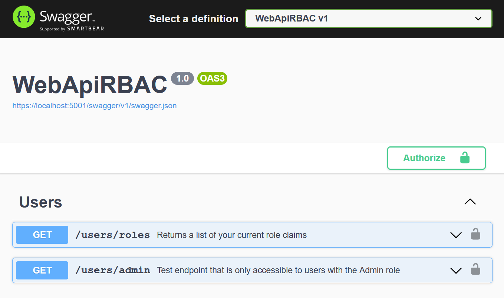

# Using IClaimsTransformation to add Role-Based Access Control (RBAC) to an ASP.NET Web API
Sample code for the blog post [Using IClaimsTransformation to add Role-Based Access Control (RBAC) to an ASP.NET Web API](https://www.ramstad.io/2022/03/31/Using-IClaimsTransformation-to-add-Role-Based-Access-Control-RBAC-to-an-ASP-NET-Web-API/) and includes a sample for setting up RBAC for an ASP.NET Core 6 Web API using Azure AD B2C.

## Prerequisites
To run this sample you must have setup an Azure AD B2C tenant, registered an application and added a user. If you want to use a different identity provider you can adapt the setup by following the [blog post](https://www.ramstad.io/2022/03/31/Using-IClaimsTransformation-to-add-Role-Based-Access-Control-RBAC-to-an-ASP-NET-Web-API/). You also need to be able to get a valid access token from your IDP to do the requests.

Note for Azure AD B2C you can find the *tenant domain name* on the overview of the B2C tenant. *ClientID* (Application ID) and *TenantId* (Directory ID) can be found under the overview of the application that you've registered.

## Update the appsettings.json file with your own settings
```javascript
"AzureAdB2C": {
    "Instance": "https://{tenant_domain_name}.b2clogin.com",
    "Domain": "{tenant_domain_name}.onmicrosoft.com",
    "TenantId": "xxxxxxxx-xxxx-xxxx-xxxx-xxxxxxxxxxxx",
    "ClientId": "{client_id}",
    "SignUpSignInPolicyId": "B2C_1_signup_signin",
    "Scope": [ "openid", "{client_id}" ],
    "AllowWebApiToBeAuthorizedByACL": true
},
```
## Swagger
I've also configured Swagger with support for JWT Bearer token authentication to make it easier to test the endpoints.


Enjoy!